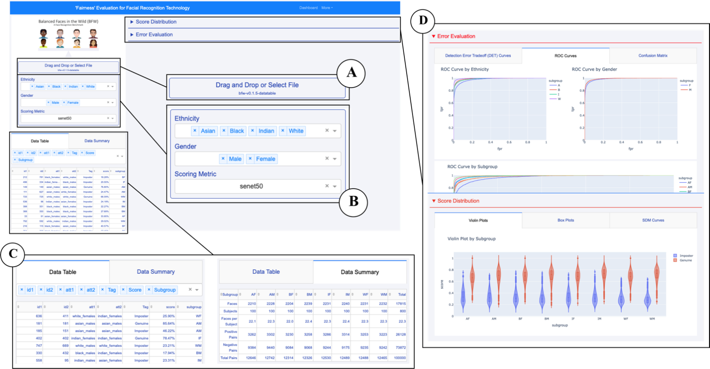

# Dashboard Walkthrough

The dashboard we have created is a very versatile tool, allowing for users of any skill level to understand it for their own motivation. 
Users can upload their own facial recognition dataset, and have it be assessed for bias present. When users upload their data, they can 
view their information in the datatable and ensure that they have uploaded the correct files and that they are being displayed correctly. From there, a data summary can be generated for an overview of the data given. Once the data is confirmed to be correct,
users can choose to view their information in 5 different visualizations.

1. Confusion matrix

2. DET Curves

3. Violing plots

4. Box plots

5. SDM Curves

This allows for multiple, different views of the data so that there can be a solid understanding of the data trends. The plots are all 
interactive and can be scaled, cropped, or put into a different view. If there is a specific area that needs emphasis, the user can 
simply crop that area and view the region of emphasis. It is a very simple interface that will yield valuable information, hope you 
enjoy. 

Dashboard layout
