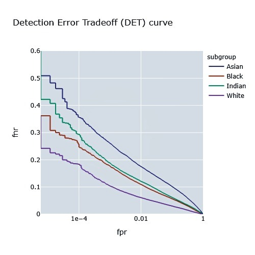
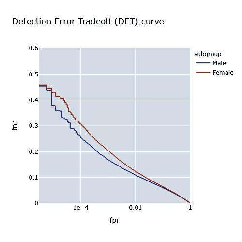
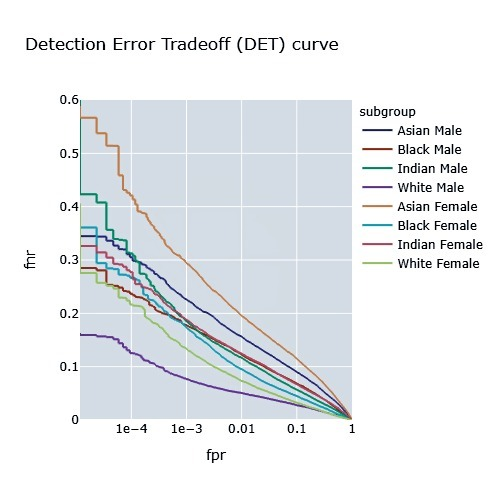

# Screenshots

DET Curve by ethnicity

DET Curve by gender

DET Curve by Subgroup (combined ethnicity and gender)

SDM Curve: Imposters (blue) have a median score of 0 and follow a gaussian pattern, genuine (orange) vary in score

Confusion Matrix: The error (%) for the various faces of BFW vs. all others. AF performs the worst as WM performs the best, meaning AF is confused most often. 
