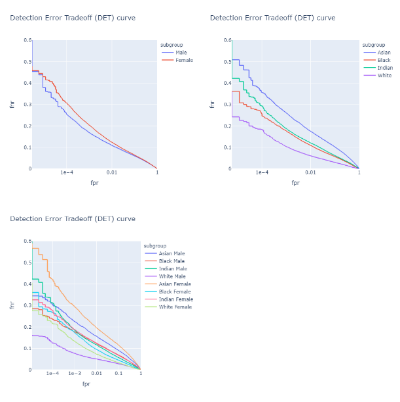
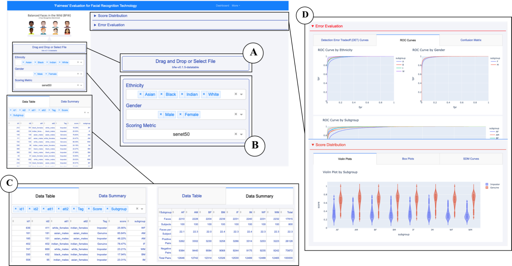

# Creating a Fairness Tool for Bias in Facial Recognition
Alice Loukianova, Dylan Dasgupta, Joseph Robinson, Rohan Krishnamurthi, and William Cutler

# Overview

Facial recognition (FR) technology is an advanced form of biometric security that involves assessing one’s face and comparing it to a known database to form an identity. This software has become increasingly popular in recent years, as the need for more complex security measures has become essential. While this concept has been around since the mid-1900s, it has only become so popular in recent years. However, with this intricate technology comes complicated issues. A major issue that has remained prevalent in the technology is a bias towards certain users because of their demographic. We will demonstrate this bias, and look at ways to eliminate it to create a nondiscriminatory evaluation available for all FR users. It is unfair some users are subject to experience more errors than others, due to their diverse backgrounds.

# Resources

We have created a dashboard tool that allows users to test their own FR dataset for bias:
https://github.com/ddasgupta4/bfw-dash

Additionally, check out our research paper on the topic:
https://github.com/rohankrishnam/FaceRecBias/blob/master/A%20Fairness%20Tool%20for%20Bias%20in%20FR%20Updated.docx

# Northeastern RISE 2020

Our Prezi presented at Northeastern RISE 2020
https://prezi.com/js6eygtyapjl/rise-2020-bias-in-fr-technology/

And finally, our poster introduction at Northeastern RISE 2020
https://github.com/rohankrishnam/FaceRecBias/blob/master/EECE2300-BIAS-RISE-2020-POSTER.pdf

BFW Image set [Robinson,Joseph]. Various faces from the Balanced Faces in the Wild (BFW) database used to establish an unbiased identification method by representing each race and gender to the same extent. 

# Abstract
We work to reveal the bias present in the current FR technology, and create a means of eliminating the bias in the form of a fairness tool, our dashboard. We have utilized a Balanced Faces in the Wild (BFW) database that equally represents each ethnicity and gender, so the faces being looked at for identification will have no bias in itself. This database is key to an equal background, to begin with, as we represent ethnicities through four subgroups, and genders through male and female. The four subgroups regarding ethnicity are: Asian, black, Indian, and white. These subgroups are used to display how the bias differs between each combination of black males, black females, Asian males, and so forth. 

Gender and Race Database Statistics: Statistics of the Balanced Faces in the Wild (BFW) [1] database, grouped here by subgroup and a specific value. There are a million pairs total under analysis, with a constant 30,000 positive pairs being assessed for each gender under said subgroup. Overall, F performs inferior to M for I and W, while M performs inferior to W for A and B.

# Key Terms
False positive: Occurs when two faces are incorrectly identified as an identical match, AKA type 1 error

False negative: Occurs when two faces of the same person are not identified as an identical match, AKA type 2 error

SDM Curve: Signal detection model curve plots a distribution of scores, using imposter and genuine scores against each other to highlight the differences between accurate and incorrect facial identifications.

DET Curve: Detection error trade off curve plots the false negative rate (FNR) as a function of the false positive rate (FPR), displaying the tradeoff between the sensitivity with FPR and specificity with FNR.

ROC Curve: Receiever operating characteristic curve plots the true positive rate (TPR) against the false positive rate (FPR). It is a probability curve yielding the most ideal values in the top left, where FPR = 0 and TPR = 1. 

# Motivation
Facial recognition is everywhere in modern technology, whether we are aware of it or not. It has been used to solve crimes, to track down missing children, and more. FR has become an efficient tool that we rely on for our population’s well-being. Because of this, the bias present in the technology has only followed in its growth in popularity, creating a dire need for resolution. If this bias continues to be present, FR technology will never be fully accurate and will always have flaws in its identification process. We must tackle two major issues to solve this issue: one being the lack of a publicly available dataset that is unbiased for companies to use in their software. Another is that each and every form of FR is unique, meaning there needs to be one form created so that there are no varying flaws from software to software. 

# Code
You can find the code behind our dashboard here at this Github repository: 

https://github.com/ddasgupta4/bfw-dash

# Screenshots

DET Curves: top left is by gender, top right is by ethnicity, and bottom left is by combined subgroups (i.e., Asian male, black female, Indian female, etc.)

SDM Curve: Imposters (blue) have a median score of 0 and follow a gaussian pattern, genuine (orange) vary in score

# Features
Our dashboard tool is universal, meaning anyone can learn how to use it and anyone can import their own unique dataset. It will use the data given to create various plots that include SDM curves, DET curves, ROC curves, and violin plots. Not only will a user's data be cleanly displayed in different visuals, but it will be assessed for bias. Each user will mst likely have a different dataset, meaning the bias will vary from set to set. Rather than having to manually assess your own data for bias, the dashboard will algorithimically do it for you. 

DashBoard Interface Layout

